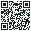

# Pocket 💚

Yet another personal finance tracker, because apparently the seventeen you already ignored weren't enough. This one watches your daily spending, nags you with weekly check-ins, and pretends it can plan your budget and debt like a responsible adult you clearly are not. Built with Expo (React Native), TypeScript, Expo Router, and Zustand — buzzwords included at no extra charge. The design lives in `design-reference.html`, in case you want proof it was ever designed at all.

## Run it (allegedly)

```bash
npm install
npx expo start
```

Then scan the QR code with the **Expo Go** app ([Android](https://play.google.com/store/apps/details?id=host.exp.exponent) / [iOS](https://apps.apple.com/app/expo-go/id982107779)). Fair warning: your phone and PC must be on the same Wi-Fi network, because technology peaked in 2010 and never recovered.

## Preview it on your iPhone right now



1. Install **[Expo Go](https://apps.apple.com/app/expo-go/id982107779)** from the App Store (free).
2. Open the Camera app and point it at the QR code above, or open Expo Go → **Enter URL manually** and paste:
   ```
   exp://gkjeyti-anonymous-8081.exp.direct
   ```

This is a **live preview**, not an installed app — it streams from a dev server tunnel running on the maintainer's machine, so it only works while that session is up (and Wi-Fi isn't even required this way, unlike the QR code Metro itself prints). If the link is dead, it just means nobody's running the dev server right now. A permanent home-screen icon needs a real TestFlight/App Store build, which is a separate step.

## Screens (yes, there are several)

- **Home** — your total balance, the money that came in and fled this week, and a payday card that only adds your salary to the balance once you confirm it actually landed (edit the amount right there if it's off)
- **History** — Daily and Weekly views behind one toggle: a spending ring judging today against your budget, a 7-day bar chart, income vs spending, and your top categories (it's coffee, isn't it)
- **Goals** — a per-cycle savings challenge (reserve it and bank what survives, or lock it away immediately), progress and motivational nagging, your wishlist with buy/wait verdicts, and a no-spend-day booster
- **Budget** — fixed bills and debts, both with a fully customizable due day (hold the row to pick the exact date), and your default salary/savings numbers
- **Add (the center + button)** — an expense/income toggle, category chips, a keypad, and a save button that makes it all painfully official

Safe-to-spend is calculated from what's actually true, not wishful thinking: `(real balance − unpaid bills − debt left this month − savings challenge) / days to next payday`. Overspend today and tomorrow's number drops; underspend and it grows.
